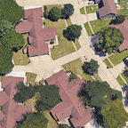

# UAV Geolocalization Using Satellite Imagery

|  &nbsp;&nbsp;  &nbsp;&nbsp; |
|:--:| 
| *3 examples of matching UAV and satellite pairs from dataset* |

## Dataset
As it can be seen from the above images, the UAV and satellite images 
differ considerably from each other. We train a dual network on this 
dataset to recognize whether a pair of images are from same scene or not.

## Training Strategy
* The UAV and satellite images are normalized with ImageNet stats
* Resnet18 models pretrained on ImageNet dataset are used 
* The model is divided into 3 layer groups for discriminative layer training
and gradual unfreezing
* One cycle policy with cosine annealing of learning rates is used for training

## Requirements
* Cuda enabled GPU
* `torch==1.4.0`
* `torchvision==0.5.0`
* `fastai` library (v1)

## Downloads
* Download [*Aerial Cities* dataset](https://uofi.app.box.com/s/4jfvpmxwiob0hcg25z4lgd5qgnk0q8nb)
* Pre-trained Models: [DualResNet18+](https://github.com/abhinavtripathi95/geolocalization/raw/master/models/R00_allcities_export) [SiamResNet18+](https://github.com/abhinavtripathi95/geolocalization/raw/master/models/R00b_allcities_export)
* Training Notebooks: [DualResNet18+](R00_allcities_dualres.ipynb) [SiamResNet18+](R00b_allcities_siamres.ipynb)
